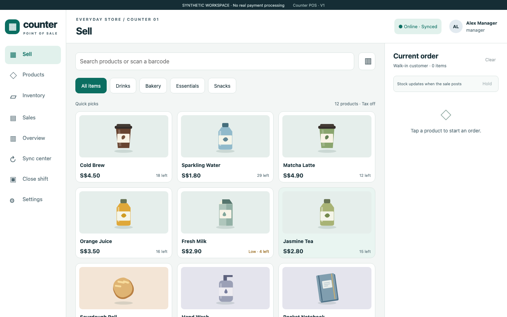

# Counter POS

A responsive, single-store PWA point of sale and inventory ledger with bounded offline cash selling. Implemented from this repository's product and engineering Markdown specifications.

**Local V1 implementation. Synthetic demonstration. No real payment or ERP integration.** Working name and software license remain unapproved. Physical-device and production readiness are separate from the automated checks.



## Run the application

Use Node **24.19.0** and PostgreSQL **16**. The local database launcher defaults to the Homebrew PostgreSQL 16 binaries; set `PG_BIN` on other machines. See the [local development runbook](docs/runbooks/local-development.md) for Docker and configuration details.

```sh
npm ci
npm run dev:db
npm run build
npm run demo
```

Open [the local application](http://localhost:3000), enter the manager demo and open a cash shift. Add **2 Cold Brew + Oat Cookies + Sparkling Water**, collect **20.00** for a **14.00** basket, and show **6.00** change. The demo uses actual PostgreSQL transactions and IndexedDB persistence; refreshing preserves records. The synthetic entry point is disabled in production and contains no fixed public password.

For code editing, `npm run dev` starts Vite plus the API. Test offline/install/update behavior using the built application, since Vite development mode does not register the production worker.

## Capability status

| Capability | Implementation / evidence |
| --- | --- |
| Cookie authentication, roles, CSRF, named terminal, one shift | Implemented; PostgreSQL authorization/immutability checks |
| Products, categories, archive and immutable price revisions | Implemented; paginated administration, stale edits and historical receipts tested |
| Stock receipt/count adjustment and immutable ledger | Implemented; stable retry IDs, version conflicts and ledger reconciliation tested |
| Search, keyboard-wedge input, quantity, undo and local holds | Implemented; browser input/focus tested; physical scanner NOT RUN |
| Cash and one manual external Card/PayNow record | Implemented; offline external methods blocked; no provider verification |
| Atomic sale posting and permanent UUID/hash replay | Tested concurrently and with an actual dropped response after COMMIT |
| Linked manager refunds, cumulative rounding and restock choice | Concurrency, partial remainder and damaged-return checks |
| Daily totals, low stock, CSV of shown rows, audit history | Implemented; reports exclude tender and pending-local amounts |
| Cash in/out, count draft, terminal reconciliation and close | Implemented; pending/quarantine/negative-stock/variance gates |
| IndexedDB atomic sale/outbox, writer lease and foreground retry | Reload, quota abort, lease takeover, auth recovery and watermark tests |
| Installable shell and explicit safe worker update | Actual N→N+1 waiting-worker test with pending data |
| Encrypted browser recovery and database restore rehearsal | Implemented and exercised in synthetic isolated environments |
| ERP adapter / automated payments / fiscal compliance | Deferred; no live integration or compliance claim |

The [implementation ADR](docs/adr/001-v1-implementation.md) records all defaults and contract clarifications. The [QA report](docs/qa/REPORT.md) states exact executed checks and physical/remote items not run. The original [design-bundle validation](validation/REPORT.md), PDFs and HTML prototype remain historical design evidence.

## Verify

```sh
npm run build
npm run format:check
npm run security:check
npm test
npm run test:integration
npx playwright install chromium
npm run test:e2e
npm run backup:rehearse
npm audit --audit-level=moderate
```

Run database tests sequentially. Test launchers reset only the loopback `counter_pos_test` fixture database and refuse other names/hosts. CI is defined in `.github/workflows/ci.yml`; a local pass does not claim that remote CI ran.

## Structure and integrity

- `apps/web`: React/TypeScript, Dexie, responsive cash workflow and shell update UX.
- `apps/api`: Fastify modules for authentication, catalogue, stock, sales, returns, shifts and reporting.
- `packages/domain`: bounded integer money, tax and cumulative refund allocation.
- `packages/contracts`: runtime input validation and shared DTOs.
- `infra/migrations`: ordered transactionally recorded SQL and a separate non-owner runtime role.
- `tests`: pure rules, disposable PostgreSQL integration, and real Chromium browser scenarios.
- `docs/qa`: actual execution evidence and screenshots; `docs/runbooks`: operating/recovery instructions.
- `specs`: implemented [OpenAPI](specs/openapi.yaml), original reference schema and synthetic fixtures.
- `design`, `prototype`, `reading`, `pdf`: preserved design kit. Open `START-HERE.html` for the original specification navigation.

A client sale UUID is permanent; a receipt number is display metadata. Cash tender is not revenue. Sale/payment/stock/audit commit together, and identical replay returns the original receipt. Prices/names are frozen in historical lines. Stock is a ledger plus its transactional projection. Refunds are immutable linked records, with cumulative allocation preserving the final cent.

## Offline and recovery boundaries

Complete online sign-in, catalogue download, local storage self-test, device enrollment and shift opening first. Permits allow cash only for at most twelve hours and 200 sales, with no offline discounts. First login, product/stock changes, refunds and final close require the server. A reload while disconnected preserves queued sales but blocks new sales until trustworthy time is re-established online.

“Saved on this device” is distinct from “Synced”. Open the app to finish foreground sync. Browser storage may be cleared/evicted or lost with the device; it is not a backup. Never delete pending records to recover a failure. Read the [recovery runbook](docs/runbooks/recovery.md) before handling a review case or backup.

No deployment, public publishing, live migration, real customer data, payment provider, Globe3 write, hardware certification or legal tax setup is included. The next release gate is physical iPhone/Android/thermal-printer/scanner verification and reviewed operational backup/hosting configuration.
